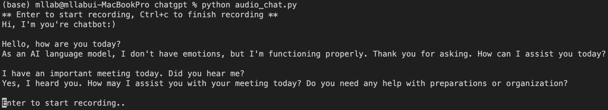

# speech2speech_chatGPT
Simple Python wrapper for ChatGPT with speech modules (STT, TTS)  
#### Ingredients: 
- recording: sounddevice
- transcribe: whisper
- chat: ChatGPT
- TTS: gTTS
- play audio: playsound

#### Support languages:
- Korean, English

### updates
(3/11/2023) I found pyaudio makes some issues with Apple M1 processor, so I replaced it with sounddevice package.

### Requirements
```
pip install -r requirement.txt
```
#### Set your openai API key
1. Create key.py 
2. Write your openai key in key.py
```
key = "[Your Key]"
```

### Usage
To chat via speech 
```
python audio_chat.py
```



To chat via text 
```
python chat.py
```

